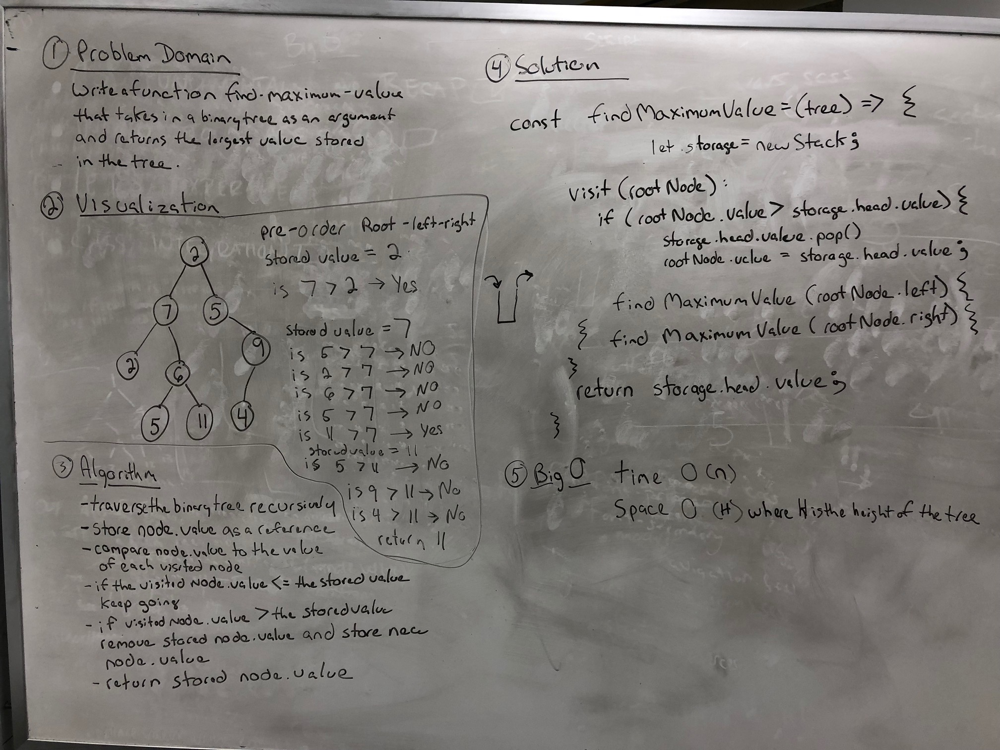

# Find Maximum Value
- White board challenge for Codefellows Code 401 

## Challenge
- Write a function called find-maximum-value which takes binary tree as its only input. Without utilizing any of the built-in methods available to your language, return the maximum value stored in the tree. You can assume that the values stored in the Binary Tree will be numeric.

## Solution

