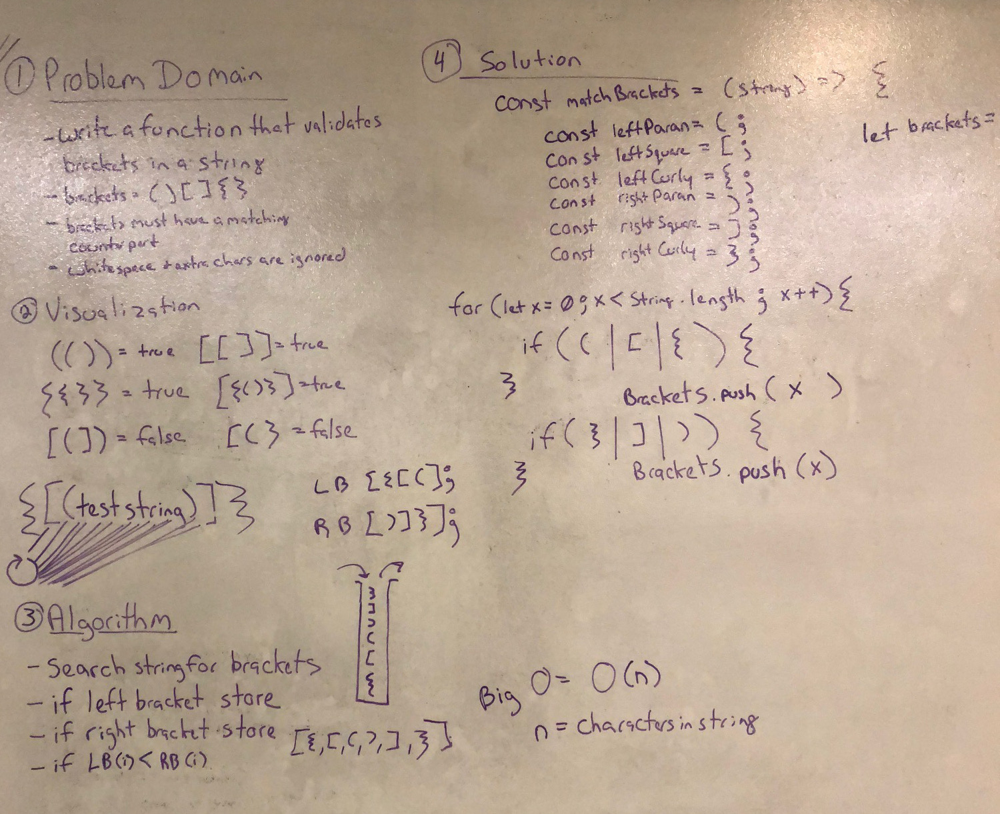

# Multi-bracket Validation.
- Whiteboard challenge #13 from Codefellows Code 401 Advanced Javascript

## Challenge
- create a function called multiBracketValidation(input).  Your function should take a string as its only argument, and should return a boolean representing whether or not the brackets in the string are balanced. There are 3 types of brackets:
	- Round Brackets : ()
	- Square Brackets : []
	- Curly Brackets : {}
## Solution

