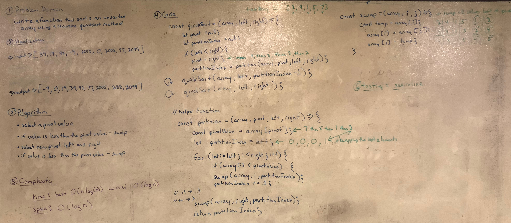

## Quicksort
- Whiteboard challenge from Code Fellows Code 401

## Challenge
- Write a function that accepts an array of integers, and returns an array sorted by a recursive quicksort algorithm.

## Solution
