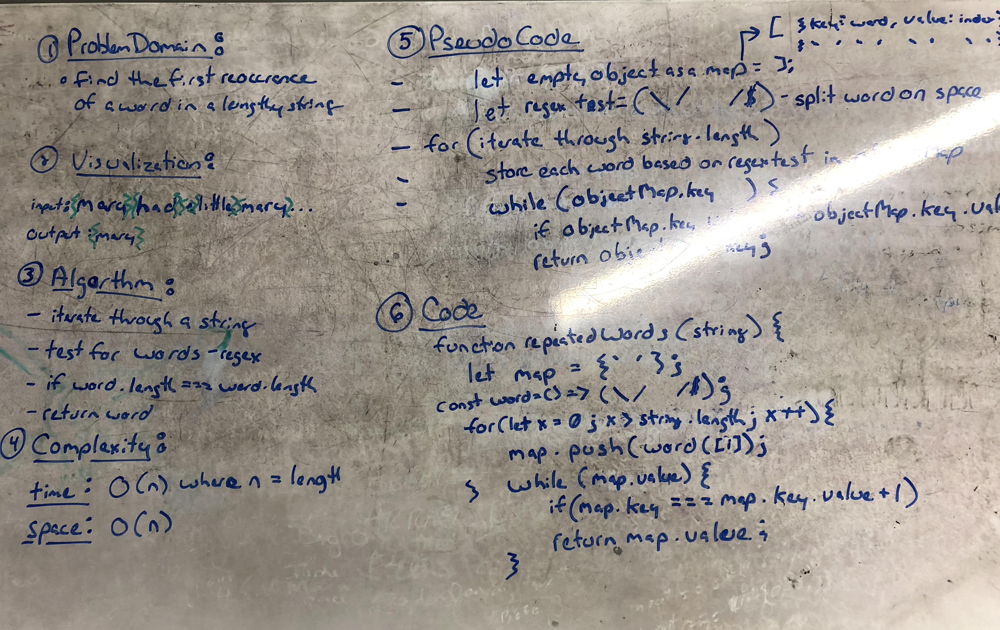

## Repeated Words
- Whiteboard challenge from Codefellows Code 401

## Challenge
- Write a function that accepts a lengthy string parameter.

- Return the first word to occur more than once in that provided string.

## Solution
